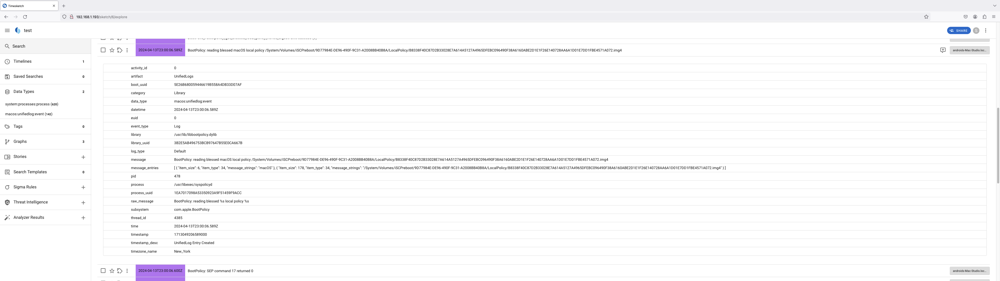

# Timesketch

Using the artemis API you may timeline artifacts and optionally upload to
Timesketch for analysis.

[Timesketch](https://timesketch.org/) is an open source timeline analysis web
application created by Google.

In order to upload data to Timesketch you will first need to timeline the data.

Currently artemis provides a simple function to help timeline artifacts it can
parse: [timelineArtifact](../Helper/timesketch).

:::warning

Just like uploading to the [cloud](../../Intro//Collections/uploads.md)
currently artemis does not securely protect credentials used to authenticate to
Timesketch.

**This is important.** Timesketch has very limited support for any kind of
account permissions. If you create an account for artemis and an unauthorized
user obtains the credentials for the account they will be able upload, delete,
etc any data uploaded by artemis.

If you do not want to expose Timesketch credentials, you can
[timeline](./timelines.md) the data to a local directory, network share, or
external drive. Then upload the data using an alternative tool.

:::

A sample script below shows how to pull a process listing and upload to
Timesketch.

```typescript
import { hostname, processListing } from ".././artemis-api/mod";
import { Timesketch } from ".././artemis-api/src/timesketch/client";
import {
  TimesketchAuth,
  TimesketchAuthType,
} from ".././artemis-api/types/timesketch/client";
import { TimesketchArtifact } from ".././artemis-api/types/timesketch/timeline";

async function main() {
  const results = processListing(true, false, false, true);
  console.log(results.length);

  const auth: TimesketchAuth = {
    url: "http://192.168.1.193",
    username: "sketchy",
    password: "password",
    verify_ssl: false,
    auth_type: TimesketchAuthType.CREDS,
    sketch_id: 1,
  };

  // Name of timeline
  const host = hostname();
  // Create a Timesketch client
  const client = new Timesketch(auth, host);

  const status = await client.timelineAndUpload(
    results,
    TimesketchArtifact.PROCESSESS,
  );
  console.log(status);
}

main();
```

A quick walkthrough for this script:

1. `async function main()` Since uploading to Timesketch is an async operation,
   out script has to use async
2. `processListing(true, false, false, true);` Pull a process listing using
   artemis
3. Initialize the Timesketch client.

```typescript
const auth: TimesketchAuth = {
  url: "http://192.168.1.193",
  username: "sketchy",
  password: "password", // Reminder!: Artemis currently does not safely protect credentials
  verify_ssl: false,
  auth_type: TimesketchAuthType.CREDS,
  sketch_id: 1, // Optional
};
```

Specifying the **sketch_id** is optional. If you do not provide one, artemis
will create a new sketch

4. `new Timesketch(auth, host);` Create our Timesketch client using the **auth**
   object above and system hostname for the timeline name.

5. Timeline and upload the data to Timesketch!

```typescript
const status = await client.timelineAndUpload(
  results,
  TimesketchArtifact.PROCESSESS,
);
```



:::info

Artemis can only execute JavaScript code. You will to
[bundle](../../Intro/Scripting/bundling.md#esbuild) this TypeScript code before you can run
this example.

:::

## Limitations and Possible Issues

Timesketch is primarily used to ingest
[Plaso](https://github.com/log2timeline/plaso) files. While it has support for
uploading other files (csv, excel sheets, and JSONL) it expects that data to be
uploaded from either:

- WebUI
- Python API library

Since TypeScript is used for the artemis API, our Timesketch client is created
from scratch with the goal of trying to replicate the upload features of the
Python API library

Some known limitations that have been observed:

- Timelines get [renamed](https://github.com/google/timesketch/issues/3052).
- Possible slowness if a timeline has alot of
  [data sources](https://github.com/google/timesketch/issues/3075)

Possible workarounds:

- [Timeline](./timelines.md) your data to JSONL files. Combine them into one
  JSONL file. Then upload via WebUI
