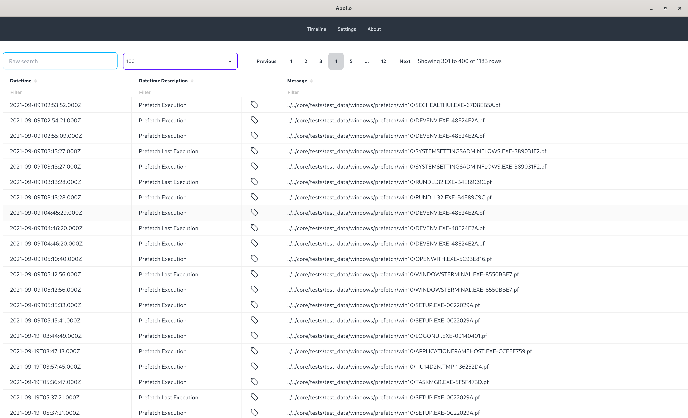
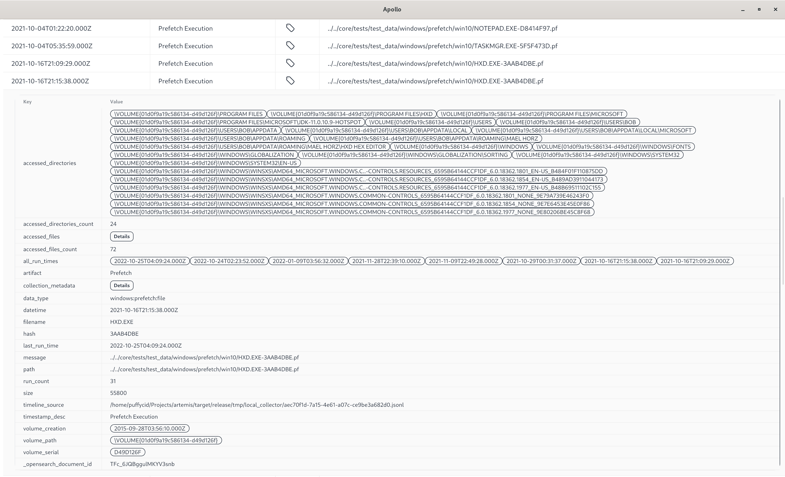
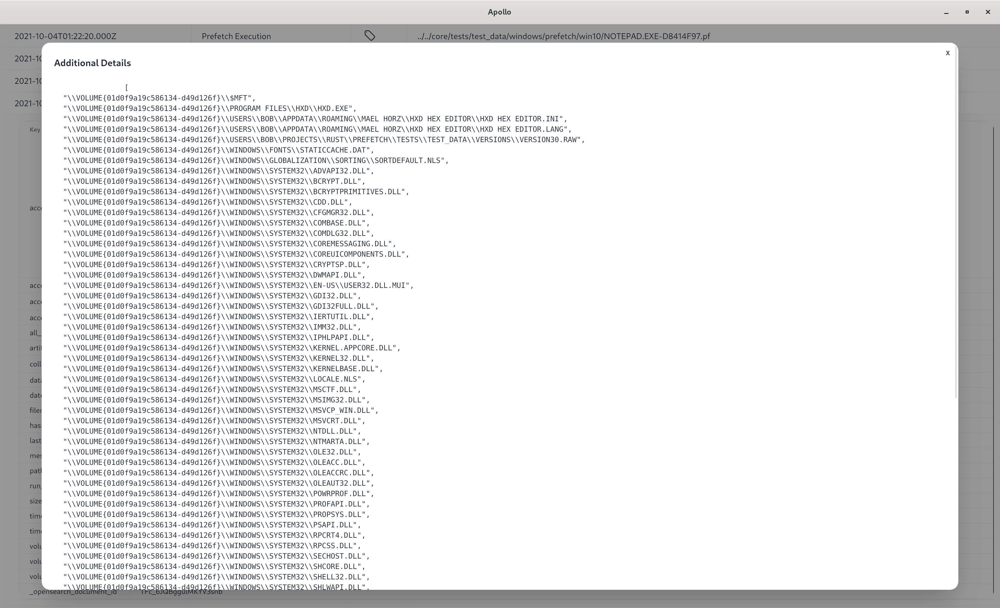

# Introduction

Apollo is an **experimental** cross platform timelining GUI tool to review
artemis data. It is heavily inspired by the
[Timesketch](https://timesketch.org/) project. However, Apollo uses the
[Tauri](https://tauri.app) GUI framework and is _not_ a web app.

Similar to Timesketch, apollo uses [OpenSearch](https://opensearch.org/) to
store and query data.

# How to build

Apollo requires a OpenSearch instance in order to store and query data. Podman
or docker is the easiest way to setup OpenSearch

1. Install Podman or Docker on your system. Podman is recommended
2. You can use the
   [setup scripts](https://github.com/puffyCid/artemis/tree/main/apollo) in the
   artemis repo to quickly spin up a Podman OpenSearch container
3. Install NodeJS and npm
4. Clone the [artemis](https://github.com/puffyCid/artemis) repo
5. Navigate to apollo directory
6. Setup TailwindCSS: `npm run tailwind`
7. Run `npm run tauri dev` to start a local instance or use
   `npm run tauri build` to compile a release binary

# Uploading data

Apollo uses the same timeline format as Timesketch. Timelined data must have the
following fields:

1. Datetime (datetime)
2. Timestamp Description (timestamp_desc)
3. Message (message)
4. Data type (data_type)

Apollo supports timelining JSONL output from artemis. For example, if you
collect and parse Windows Registry data
(`artemis acquire --format jsonl registry --alt-file <path to NTUSER.DAT>`).

Apollo can timeline and upload the data to OpenSearch

# Screenshots

Timeline View 

Timeline Entry Details 

Timeline Additional Details

